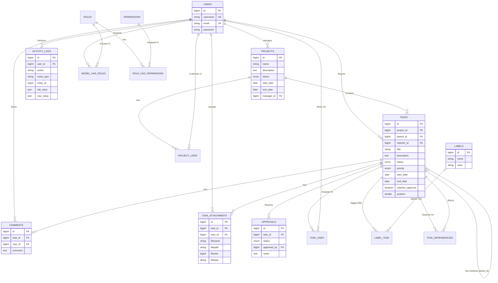

# Entity Relationship Diagram (ERD)

Berikut adalah struktur representasi relasi antar entitas utama pada sistem **Project Management System**.

## Relasi Penting
1. **Projects - Users (Manager & Members)**:
   - Satu Project dipimpin oleh satu Project Manager (`manager_id` di tabel `projects`).
   - Project memiliki banyak Member (relasi M:N melalui pivot tabel `project_user`).
2. **Tasks - Dependencies**:
   - Task dapat memblokir task lain. Relasi direpresentasikan melalui pivot tabel `task_dependencies` yang mengaitkan `task_id` dengan `depends_on_task_id`.
3. **Tasks - Approvals**:
   - Task yang memerlukan *approval* akan memiliki rekam jejak persetujuan pada tabel `approvals`.
4. **Audit Trail (Activity Logs)**:
   - Aktivitas penting dicatat secara *polymorphic* melalui `entity_type` dan `entity_id` untuk dapat melacak perubahan yang spesifik terhadap entitas manapun (Task, Project, dll).
