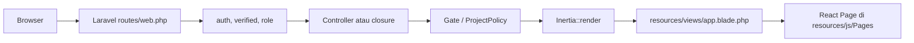
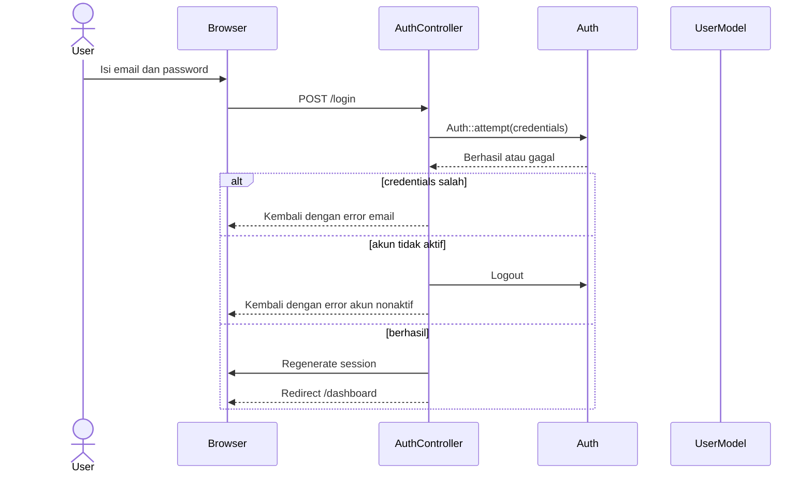
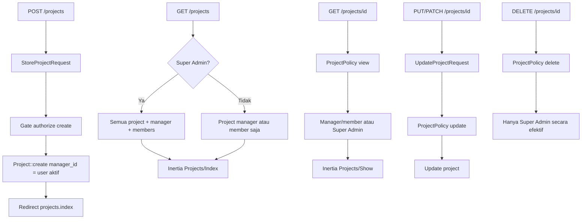

# Project Management System

## 1. Ringkasan Sistem

Project Management System adalah aplikasi web internal untuk autentikasi pengguna, pengaturan role dan permission, serta pengelolaan project. Implementasi saat ini menggunakan:

- Laravel 12 dan PHP 8.2+ pada backend.
- Inertia.js sebagai jembatan server-side Laravel ke frontend.
- React dan TypeScript pada frontend.
- Eloquent ORM dan migration Laravel untuk persistence.
- Spatie Laravel Permission untuk RBAC.
- Session authentication untuk alur web.
- PHPUnit untuk feature test.

Arsitektur yang benar-benar digunakan saat ini adalah **Laravel monolith dengan Inertia**, bukan REST API terpisah. File `routes/api.php` hanya berisi komentar bahwa route API dipindahkan ke `routes/web.php`.

Dokumen ini memisahkan kemampuan yang sudah tersedia dari kemampuan yang baru didefinisikan di spesifikasi agar status proyek tidak keliru dibaca sebagai fitur selesai.

## 2. Struktur Folder Aktual

```text
ProjectManagementSystem/
├── app/
│   ├── Http/
│   │   ├── Controllers/
│   │   │   ├── Auth/AuthController.php
│   │   │   ├── Controller.php
│   │   │   └── ProjectController.php
│   │   ├── Middleware/
│   │   │   ├── HandleInertiaRequests.php
│   │   │   └── RoleMiddleware.php
│   │   └── Requests/
│   │       ├── Auth/LoginRequest.php
│   │       ├── Auth/RegisterRequest.php
│   │       ├── StoreProjectRequest.php
│   │       └── UpdateProjectRequest.php
│   ├── Models/
│   │   ├── Project.php
│   │   ├── Role.php
│   │   └── User.php
│   ├── Policies/ProjectPolicy.php
│   └── Providers/AppServiceProvider.php
├── bootstrap/
│   └── app.php
├── config/
│   ├── auth.php
│   ├── database.php
│   ├── inertia.php
│   ├── permission.php
│   └── ...
├── database/
│   ├── factories/ProjectFactory.php, UserFactory.php
│   ├── migrations/
│   │   ├── users, sessions, password reset tokens
│   │   ├── projects dan project_user
│   │   └── tabel RBAC Spatie
│   └── seeders/
│       ├── DatabaseSeeder.php
│       ├── RoleAndPermissionSeeder.php
│       ├── RoleSeeder.php
│       └── UserSeeder.php
├── resources/
│   ├── css/app.css
│   ├── js/
│   │   ├── app.tsx
│   │   ├── bootstrap.ts
│   │   ├── Layouts/AuthenticatedLayout.tsx
│   │   ├── Pages/
│   │   │   ├── Auth/Login.tsx
│   │   │   ├── Dashboard.tsx
│   │   │   └── Projects/{Profile,Show}.tsx
│   │   └── types/index.d.ts
│   └── views/app.blade.php
├── routes/web.php
├── routes/api.php
├── tests/
│   ├── Feature/AuthTest.php
│   ├── Feature/ProjectAuthorizationTest.php
│   └── Unit/ExampleTest.php
├── public/build/
├── storage/
├── composer.json
├── package.json
└── app_specification.md / brief.md
```

### Struktur target yang disarankan

Struktur berikut cocok untuk melanjutkan spesifikasi tanpa mengubah fondasi Inertia yang sudah ada:

```text
app/
├── Actions/                    # Use case kecil: create project, assign member, update status
├── Http/
│   ├── Controllers/
│   │   ├── Auth/
│   │   ├── Projects/
│   │   ├── Tasks/
│   │   ├── Attachments/
│   │   └── Admin/
│   ├── Requests/{Auth,Projects,Tasks,Attachments}/
│   └── Resources/              # Bentuk data konsisten untuk Inertia/API
├── Jobs/                       # Notifikasi, deadline alert, pekerjaan async
├── Models/                     # Project, Task, Comment, Attachment, Approval, ActivityLog
├── Notifications/
├── Observers/                  # Audit Project dan Task
├── Policies/                   # Policy per resource
├── Services/                   # Aturan lintas model, misalnya dependency task
└── Support/                    # Enum, helper, dan kontrak umum

resources/js/
├── Components/
├── Layouts/
├── Pages/
│   ├── Auth/
│   ├── Dashboard/
│   ├── Projects/
│   ├── Tasks/
│   └── Admin/
├── types/
└── lib/

database/
├── factories/
├── migrations/
└── seeders/
```

Struktur target adalah rekomendasi organisasi kode; folder tersebut belum seluruhnya tersedia.

## 3. Alur Kerja Sistem Saat Ini

### 3.1 Bootstrap dan render halaman



`resources/js/app.tsx` mencari page berdasarkan nama komponen Inertia, misalnya `Projects/Show` menjadi `resources/js/Pages/Projects/Show.tsx`.

### 3.2 Login



Password di-hash melalui cast `hashed` pada `User`. Saat login berhasil, session diregenerasi untuk mengurangi risiko session fixation. Middleware Inertia membagikan user, role, permission, dan flash message ke frontend.

### 3.3 Registrasi user

1. User terautentikasi mengakses `POST /register`.
2. Route mensyaratkan role `super_admin` atau `Super Admin`.
3. `RegisterRequest` memvalidasi input.
4. `AuthController::register()` membuat user dan memakai role Spatie.
5. Role default adalah `member` jika field role tidak dikirim.

### 3.4 Siklus project



Aturan akses project yang sudah diterapkan:

- Super Admin melewati policy melalui `ProjectPolicy::before()`.
- User biasa harus memiliki permission `projects.view` dan menjadi manager atau member project tertentu.
- Project Manager hanya dapat mengubah project yang `manager_id`-nya adalah dirinya.
- Hanya Super Admin yang dapat menghapus project melalui kombinasi policy dan permission.
- Query index menggunakan eager loading `manager` dan `members`, serta pagination 15 item.

## 4. Business Logic yang Sudah Berjalan

### Authentication dan account

- Login menggunakan email/password.
- Akun dengan `is_active = false` ditolak.
- Logout menghapus session dan meregenerasi CSRF token.
- Password memakai hashing otomatis dari model cast.
- Route terlindungi menggunakan middleware `auth` dan `verified`.

### RBAC

Spatie mengelola role dan permission melalui tabel `roles`, `permissions`, `model_has_roles`, `model_has_permissions`, dan `role_has_permissions`. Role yang diseed: `super_admin`, `project_manager`, `member`, dan `viewer`.

Permission yang sudah didefinisikan mencakup user, project, task, attachment, comment, dan activity log. Sebagian permission task/attachment/comment belum memiliki fitur pemakai di controller maupun route.

### Project

- Project memiliki status `planning`, `active`, `on_hold`, `completed`, atau `cancelled`.
- `end_date` harus sama atau setelah `start_date` pada create dan update.
- Manager diset dari user yang sedang login ketika create; input `manager_id` tidak diterima dari request.
- Relasi manager adalah one-to-many.
- Relasi members adalah many-to-many melalui `project_user`.
- Foreign key project ke user memakai `restrictOnDelete`; pivot memakai `cascadeOnDelete`.

### Authorization anti-IDOR

Policy memeriksa object project yang diminta, bukan hanya role global. Karena itu member Project A tidak dapat membuka Project B, meskipun keduanya memiliki role yang sama. Inilah kontrol utama terhadap akses langsung menggunakan ID project.

## 5. Business Logic yang Direncanakan tetapi Belum Terimplementasi

Berdasarkan `app_specification.md` dan `brief.md`, area berikut masih berupa target desain:

- Task dan subtask: model, migration, CRUD, assignee, priority, status workflow.
- Validasi dependency task sebelum status menjadi `done`.
- Kanban board dan fractional position untuk reorder task.
- Approval flow: submit review, approve, reject, dan revision required.
- Comment dan mention.
- Attachment private storage, validasi MIME/ukuran, download policy.
- Activity log dan observer untuk perubahan Project/Task.
- Notifications database dan deadline alert.
- Queue untuk email, mention, dan alert.
- Cache untuk KPI dashboard.
- Admin UI untuk user, role, permission, dan audit log.
- REST API yang konsisten. Saat ini `routes/api.php` belum memiliki endpoint.

## 6. Status Fitur Saat Ini

| Fitur | Status | Bukti / catatan |
|---|---|---|
| Redirect root ke login | Selesai | `routes/web.php` |
| Halaman login Inertia | Selesai sebagian | `AuthController` dan `Pages/Auth/Login.tsx` tersedia |
| Login valid | Selesai | `AuthTest` mencakup seluruh role |
| Login gagal / akun nonaktif | Selesai | Diuji di `AuthTest` |
| Logout dan session invalidation | Selesai | `AuthController::logout()` |
| Registrasi user oleh Super Admin | Selesai backend | Route role-protected dan test tersedia; belum ada halaman admin |
| RBAC Spatie | Selesai backend | Seeder role/permission dan `User::HasRoles` |
| Share user, role, permission ke Inertia | Selesai | `HandleInertiaRequests` |
| Dashboard | Prototype | Tampilan ada, tetapi angka KPI masih hard-coded |
| Create project | Selesai backend | Request, policy, controller, model, migration |
| List project | Backend tersedia, frontend belum lengkap | Controller merender `Projects/Index`, tetapi page tersebut belum ada di workspace |
| Detail project | Selesai minimal | Policy, controller, page `Projects/Show`; UI baru menampilkan nama |
| Update project | Selesai backend | Request, policy, controller; UI belum terlihat |
| Delete project | Selesai backend | Super Admin diuji; UI belum terlihat |
| Project membership management | Data relation saja | Pivot dan relation ada, route/controller mutasi belum ada |
| Anti-IDOR project | Selesai backend | `ProjectPolicy` dan `ProjectAuthorizationTest` |
| Task management | Belum dimulai | Tidak ada model/migration/controller/page task |
| Approval | Belum dimulai | Belum ada resource implementasi |
| Comment | Belum dimulai | Belum ada resource implementasi |
| Attachment | Belum dimulai | Belum ada resource/policy/route download |
| Audit log | Belum dimulai | Belum ada tabel/model/observer |
| Queue, notification, cache KPI | Belum dimulai | Belum ada implementasi fitur terkait |
| REST API | Belum dimulai | `routes/api.php` kosong secara fungsional |
| Automated tests | Fondasi tersedia | Test auth dan authorization project ada; cakupan fitur inti lainnya belum ada |

Secara keseluruhan, sistem saat ini berada pada tahap **MVP fondasi: authentication + RBAC + project authorization/CRUD backend**, belum pada tahap fitur penuh Project Management System.

## 7. Temuan Teknis yang Perlu Diperhatikan

1. `ProjectController::index()` merender `Projects/Index`, tetapi file page tersebut belum tersedia. Akses `GET /projects` berpotensi gagal saat resolver Inertia mencari komponen itu.
2. `AuthController::me()` merender `Auth/Profile`, sedangkan page yang terlihat berada di `resources/js/Pages/Projects/Profile.tsx`. Nama komponen tidak konsisten; test saat ini sengaja tidak memvalidasi keberadaan page (`component('Auth/Profile', false)`).
3. `RoleMiddleware` masih mencoba memuat relasi `role` dan membaca `role_name`, sedangkan `User` sudah sepenuhnya memakai Spatie `HasRoles`. Route register menggunakan middleware role bawaan Spatie, sehingga middleware custom ini tampaknya legacy dan perlu diselaraskan atau dihapus.
4. Nama permission di seeder belum sepenuhnya sama dengan spesifikasi. Contohnya implementasi memakai `tasks.update_status`, `users.manage_roles`, dan `activity_logs.view`, sedangkan spesifikasi menyebut `tasks.change_status`, `roles.manage`, dan `audit_logs.view`.
5. `Role.php` masih ada, tetapi role aktif dikelola oleh model role Spatie. Perannya perlu dipastikan agar tidak menimbulkan dua sumber kebenaran.
6. Dashboard menampilkan nilai contoh seperti `4`, `2`, dan `99.9%`; nilai tersebut belum berasal dari query database atau monitoring aktual.
7. `composer.json` menetapkan PHP `^8.2`, sementara spesifikasi menargetkan PHP 8.3+. Constraint deployment dan dokumentasi perlu disepakati.

## 8. Urutan Pengembangan yang Disarankan

1. Lengkapi page `Projects/Index`, rapikan penamaan `Auth/Profile`, dan verifikasi build frontend.
2. Selaraskan middleware legacy dan seluruh nama permission dengan satu matriks RBAC resmi.
3. Implementasikan membership management dengan policy `manageMembers` dan test anti-IDOR.
4. Tambahkan resource Task beserta enum status/priority, assignee, Form Request, Policy, dan test.
5. Tambahkan dependency validation, approval workflow, dan Kanban reorder.
6. Tambahkan comment, attachment private storage, download authorization, dan notification.
7. Implementasikan activity log observer, queue, serta cache KPI dashboard.
8. Tambahkan halaman frontend per role dan feature test untuk setiap aturan akses.
9. Bila REST API memang wajib, tentukan kontrak API lalu buat controller/resource di `routes/api.php`; jangan mencampur response JSON dan Inertia tanpa boundary yang jelas.

## 9. Validasi yang Tersedia

Perintah `php artisan test` terakhir berhasil dengan exit code `0`. Test yang ada memvalidasi login, akun nonaktif, profile access, pembatasan registrasi, dan authorization project termasuk skenario anti-IDOR.